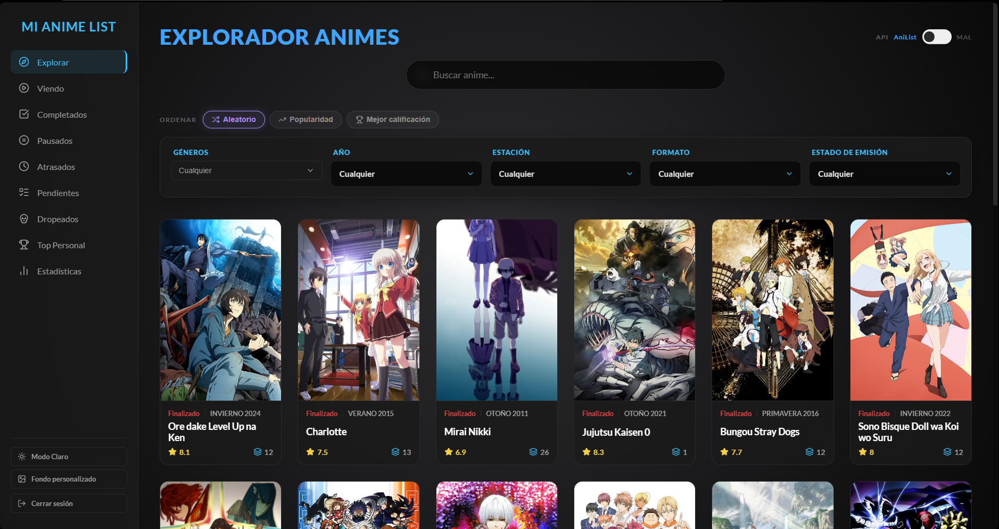
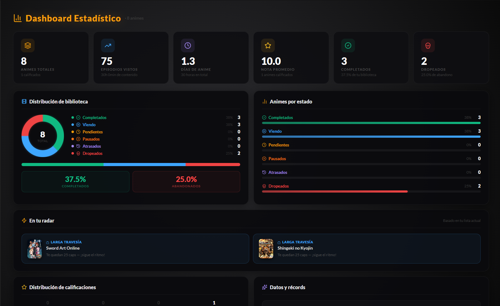
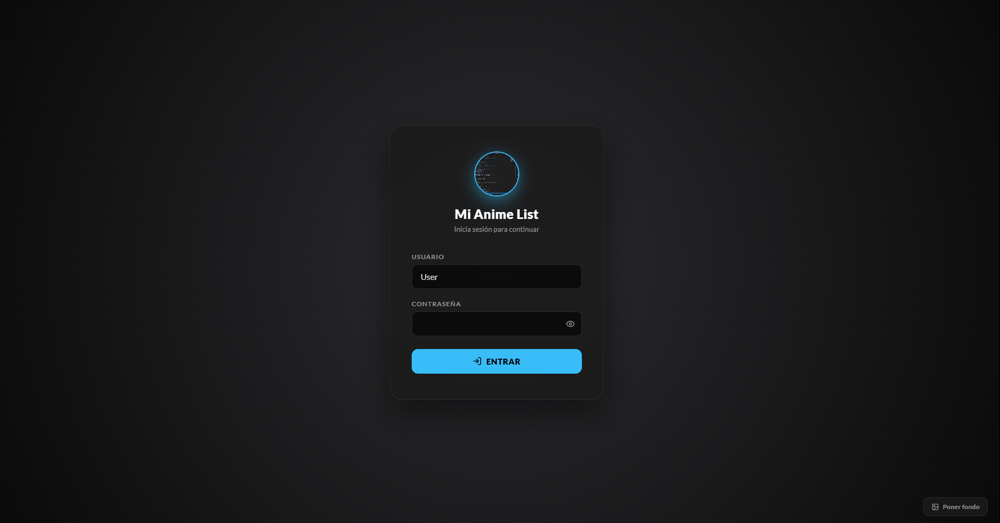

# Mi Anime List

Tracker personal de anime con buscador multi-API, sistema de listas, estadísticas y personalización visual. App local construida con React + Vite, base de datos en Supabase.

---

## Características

### Listas de seguimiento
| Sección | Descripción |
|---|---|
| **Viendo** | Anime en curso con contador de episodios por capítulo |
| **Completados** | Historial de anime terminado |
| **Pausados** | Anime en espera temporal |
| **Atrasados** | Detecta automáticamente los que llevas tiempo sin tocar |
| **Pendientes** | Cola de anime por ver |
| **Dropeados** | Cementerio con nota del capítulo donde lo dejaste |
| **Top Personal** | Ranking propio con calificación 1–10 |
| **Estadísticas** | Gráficas, podio, radar de actividad, distribución de notas |

### Explorador
- Búsqueda por nombre en tiempo real
- Filtros combinables: género, formato, estado, año, temporada
- Ordenación por Popularidad, Mejor Rating o Aleatorio
- Toggle AniList / MAL para búsqueda por nombre

### APIs
El explorador usa un algoritmo de enrutamiento dual:

| Caso | API usada |
|---|---|
| Top por rating | Jikan (MAL) — estándar oficial |
| Top por popularidad / aleatorio | AniList |
| Búsqueda por nombre | Seleccionable via toggle |
| Cualquier filtro activo | AniList (más estable, soporta year-only) |

### Personalización
- **Tema claro / oscuro** — persistido en `localStorage`, toggle en sidebar
- **Imagen de fondo** — sube cualquier imagen local, se guarda como base64 en `localStorage`; funciona tanto en el login como en la app
- **Foto de perfil** — imagen circular en la pantalla de login, guardada en `localStorage`

### Autenticación
Login local con sesión recordada **30 días** via `localStorage`. Sin backend de auth.

---

## Tech Stack

| Categoría | Librería |
|---|---|
| UI framework | React 19 + Vite 8 |
| Routing | React Router DOM 7 |
| Base de datos | Supabase (PostgreSQL) |
| HTTP | Axios |
| Iconos | lucide-react |
| Modales | SweetAlert2 |
| Gráficas | Recharts |
| Animaciones | Framer Motion |
| APIs externas | AniList GraphQL, Jikan v4 (MAL) |

---

## Estructura del proyecto

```
src/
├── context/
│   ├── AuthContext.jsx      # Sesión local (login / logout / 30d expiry)
│   └── ThemeContext.jsx     # Tema + imagen de fondo (localStorage)
├── services/
│   ├── anilistService.js    # AniList GraphQL — buscarTop, buscarPorNombre, buscarConFiltros
│   └── jikanService.js      # Jikan v4 — buscarTop, buscarPorNombre (retry 3x en 504)
├── components/
│   ├── Sidebar.jsx          # Navegación + toggle tema + picker de fondo
│   ├── ApiToggle.jsx        # Switch AniList ↔ MAL
│   └── Switch.jsx           # CSS toggle reutilizable
├── pages/
│   ├── Login.jsx            # Pantalla de acceso con avatar personalizable
│   ├── Explorar.jsx         # Buscador + filtros + grid de anime
│   ├── Viendo.jsx
│   ├── Completados.jsx
│   ├── Pausados.jsx
│   ├── Atrasados.jsx
│   ├── Pendientes.jsx
│   ├── DroppedAnimes.jsx
│   ├── TopPersonal.jsx
│   └── Statistics.jsx
├── App.jsx
├── index.css               # Variables CSS (dark/light) + estilos globales
└── supabase.js
```

---

## Setup

### 1. Clonar e instalar

```bash
git clone <repo>
cd mi-anime-list
npm install
```

### 2. Configurar Supabase

En `src/supabase.js` reemplaza las credenciales:

```js
const supabaseUrl = 'TU_SUPABASE_URL';
const supabaseKey = 'TU_SUPABASE_ANON_KEY';
```

La tabla requerida en Supabase:

```sql
create table anime_list (
  id              uuid primary key default gen_random_uuid(),
  mal_id          integer,
  anilist_id      integer,
  titulo          text not null,
  imagen          text,
  estado          text,          -- 'viendo' | 'completado' | 'pausado' | 'pendiente' | 'dropeado'
  episodio_actual integer default 0,
  episodios_totales integer default 0,
  calificacion    numeric(3,1),
  ranking         integer,
  comentario_dropeo text,
  fecha_agregado  timestamptz default now()
);
```

### 3. Credenciales de acceso

Hardcodeadas en `src/context/AuthContext.jsx`:

```
Usuario:     User
Contraseña:  Acuario17
```

### 4. Levantar en desarrollo

```bash
npm run dev
```

### 5. Build de producción

```bash
npm run build
npm run preview
```

---

## Variables CSS

El sistema de theming usa CSS custom properties definidas en `src/index.css`. Para cambiar colores, edita el bloque `:root` (dark) o `[data-theme="light"]`:

```css
:root {
  --accent-color: #38BDF8;   /* color principal */
  --bg-primary:   #0a0a0a;   /* fondo body */
  --bg-card:      rgba(26,26,26,0.85); /* tarjetas glassmorphism */
  /* ... */
}

[data-theme="light"] {
  --accent-color: #0284c7;
  --bg-primary:   #eef2f7;
  /* ... */
}
```

---

## Notas

- La Jikan API puede devolver errores 504 en páginas altas. El servicio reintenta automáticamente 3 veces con backoff.
- AniList tiene límite de 90 req/min. La app no implementa rate limiting explícito.
- El modo aleatorio usa un offset de página aleatorio dentro de las primeras páginas seguras de la API.
- Las imágenes de fondo y avatar se guardan como base64 en `localStorage`. Imágenes muy grandes (>4MB) pueden no almacenarse por el límite del navegador, pero siguen aplicándose en la sesión actual.
